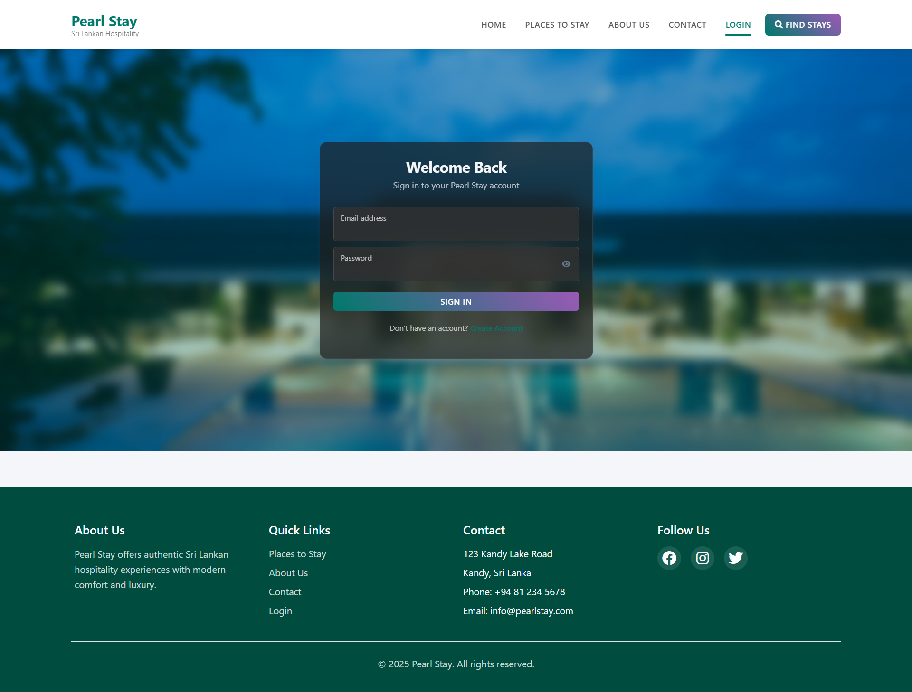
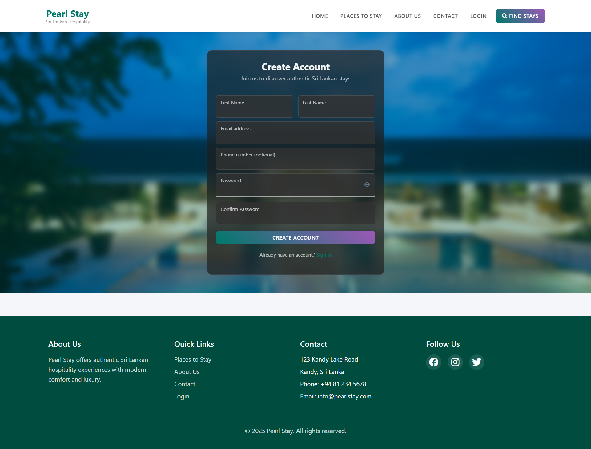
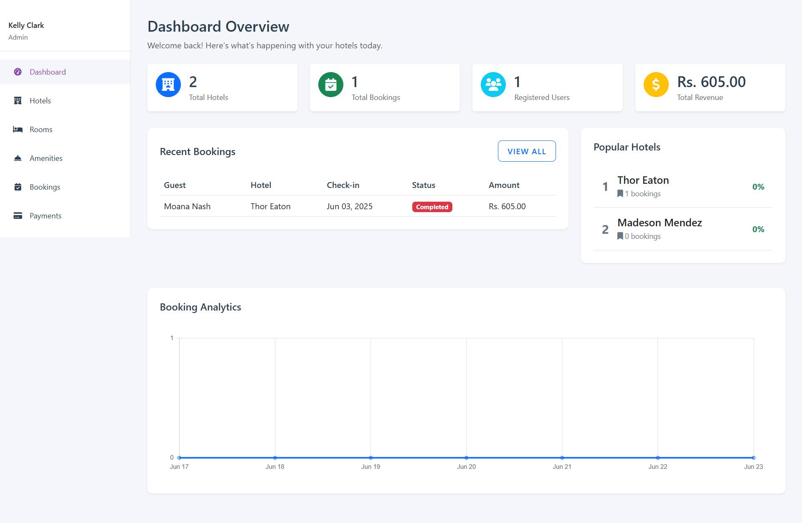
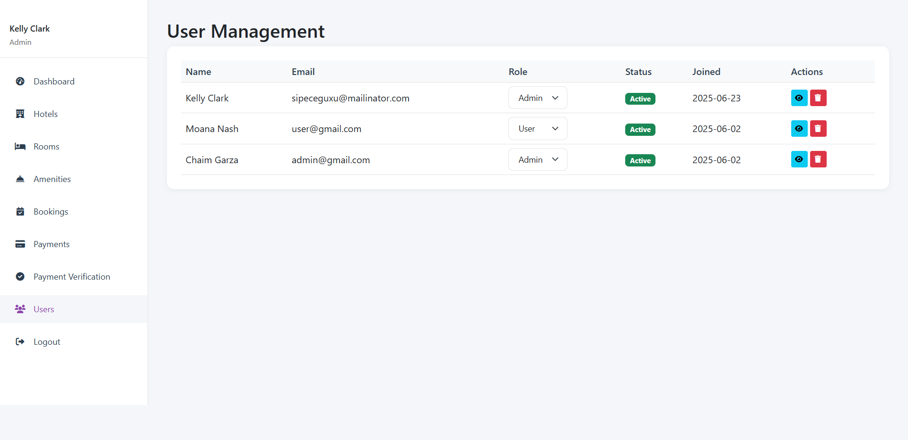
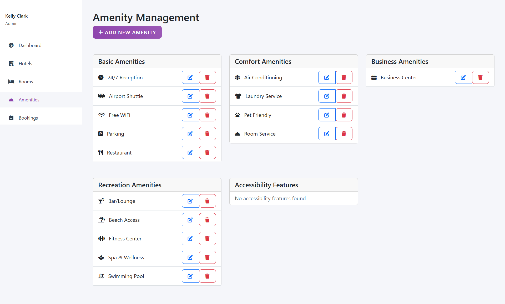

# Hotel Reservation System (Pearl Stay)

A comprehensive hotel reservation and management system that allows users to browse, book, and manage hotel reservations while providing administrators with tools to manage hotels, rooms, bookings, and users.

## Features

### For Users

- User registration and authentication
- Browse available hotels and rooms
- Advanced search functionality
- Secure booking process
- Online payment processing
- Booking management
- User profile management
- Review submission system

### For Administrators

- Comprehensive dashboard with analytics
- Hotel management
- Room type and room management
- Amenities management
- User management
- Booking oversight
- Payment verification
- Report generation

## Screenshots

### Home Page


_Main landing page of Pearl Stay_

### User Authentication


_Login interface_


_Registration interface_

### Admin Dashboard


_Administrative dashboard with statistics and quick actions_

### User Management


_Administrative user management interface_

### Amenities Management


_Hotel amenities management interface_

## Tech Stack

- PHP
- MySQL (PDO)
- HTML/CSS
- JavaScript
- Bootstrap (for styling)

## Installation

1. Clone the repository to your local machine
2. Set up a web server (Apache/Nginx) with PHP support
3. Create a MySQL database named `pearl_stay_db`
4. Import the database structure from `sql/pearl_stay_db.sql`
5. Configure the database connection in `config/db.php`
6. Configure your web server to point to the project directory

### Database Configuration

Update the following in `config/db.php`:

```php
$servername = "localhost";
$username = "your_username";
$password = "your_password";
$dbname = "pearl_stay_db";
```

## Project Structure

```
├── admin/                  # Admin panel files
│   ├── css/               # Admin-specific styles
│   ├── handlers/          # Admin action handlers
│   ├── includes/          # Admin components
│   └── js/               # Admin JavaScript files
├── assets/                # Public assets
│   ├── css/              # Stylesheets
│   ├── img/              # Images
│   └── js/               # JavaScript files
├── components/            # Reusable PHP components
├── config/                # Configuration files
├── cron/                  # Scheduled tasks
├── handlers/              # Request handlers
├── includes/             # Utility functions
├── sql/                  # Database schema
└── uploads/              # User uploaded files
```

## Features in Detail

### Booking System

- Real-time availability checking
- Secure payment processing
- Automated booking confirmation
- Booking management interface

### Admin Features

- Comprehensive booking management
- User role management
- Hotel and room management
- Payment verification system
- Report generation and export

### Automated Tasks

- Automatic cancellation of expired unpaid bookings
- Payment status monitoring
- Booking status updates

## Security Features

- Password hashing
- Session management
- Input validation
- PDO prepared statements for SQL injection prevention

## Maintenance

### Cron Jobs

The system includes automated tasks that should be scheduled:

- `cron/cancel_expired_payments.php`: Cancels unpaid bookings after expiration
- `cron/run_payment_cancellation.bat`: Windows batch file for scheduling payment cancellation

## Contributing

1. Fork the repository
2. Create your feature branch
3. Commit your changes
4. Push to the branch
5. Create a new Pull Request

## License

This project is licensed under the MIT License - see the LICENSE file for details.
